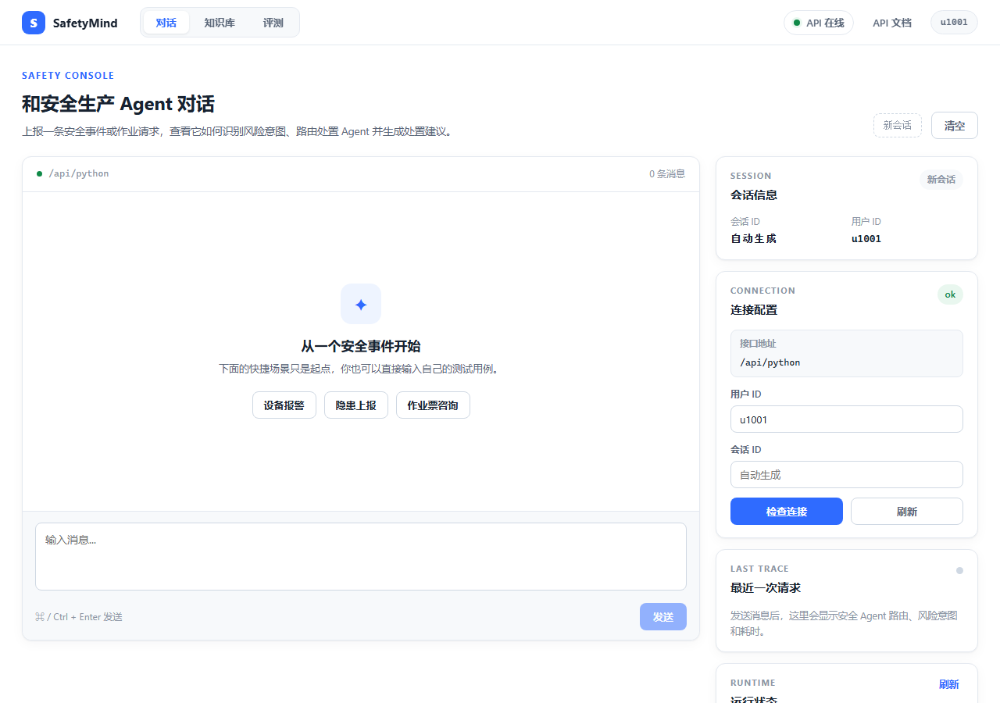
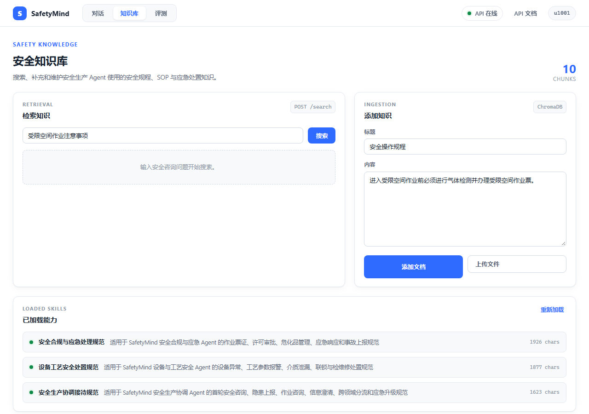
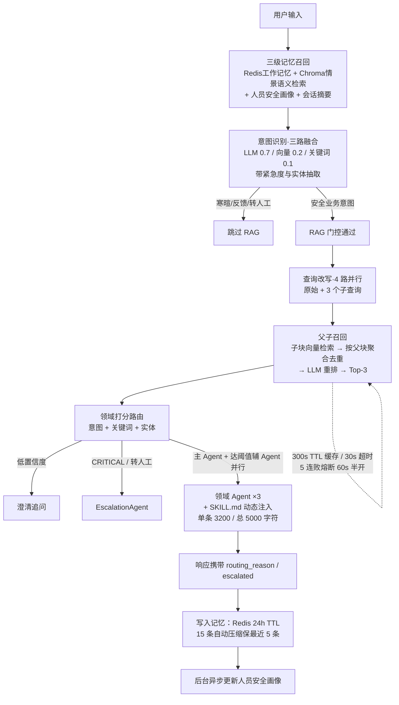

# SafetyMind

**多 Agent 路由 · 安全知识库 · 可解释、可观测、可评测的应急处置链路**

[](https://www.python.org/)
[](https://fastapi.tiangolo.com/)
[](https://vuejs.org/)
[](https://www.docker.com/)
[](https://www.anthropic.com/)

工业安全生产场景的智能问答与分流转单平台。一线员工的一句"3 号反应器超温报警了怎么处理"，背后要经过：意图识别 → 安全知识库检索 → 多 Agent 路由 → 处置 SOP 注入 → 升级判定，全程留痕可回溯。SafetyMind 用 **4 个领域 Agent + 三级记忆 + 父子召回 RAG + 运行监控**把这条链路做成一个工程上可解释的系统，提供 **桌面 / Web / Docker** 三种使用形态。

## 先看可评测性

不贴跑不出来的数字，只承诺每条链路都有对应的度量面：

| 链路环节 | 度量方式 | 入口 |
| --- | --- | --- |
| 意图识别 | Accuracy / Macro-F1 / 每类 P-R-F1，内置 13 条安全域用例 | `POST /eval/run` |
| 回答质量 | LLM-as-Judge 四维评分（相关/准确/完整/可执行） | `POST /eval/run` |
| 性能回归 | 与上次基线对比，退化超 5% 自动标记 | `data/eval/baseline.json` |
| Agent 在线表现 | 成功率 / 延迟 / 路由评分，Z-score 异常检测 | `GET /monitor` |
| 工具健康 | 熔断状态 / 缓存命中率 / 连续失败数 | `GET /monitor` |
| 路由可解释 | 每条响应携带 routing_reason / intent / urgency / 各路得分 | `POST /chat` 响应体 |

### 意图识别基准（完整方法、负结果与复现步骤见 [docs/BENCHMARK.md](docs/BENCHMARK.md)）

自建 19 类安全意图基准：2453 条（dev 1003 / test 1033 / 独立留出 test2 410），AI 自标注 + 五模型一致性审计（标注噪声率 0.9%），数据集与评测脚本随仓库开源（`benchmarks/intent/`）。

| 意图引擎 | 准确率（test n=1033，同口径） | 单条延迟 p50（CPU / GPU） |
| --- | --- | --- |
| **语义原型分类器（bge 双模型集成，零训练）** | **95.3%** | **93ms / 13ms** |
| LLM 三路融合 | 64.6% | 2047ms / — |
| pattern 关键词 | 56.5% | <1ms |
| Laya 判别式路由 | 55.6% | 305ms / 57.5ms |

- 独立留出集（test2）二次评测 94.2%，两次一致；分档：规范表述 97.4% / 口语改写 93.6% / 边界易混 81.3%
- 集成引擎已接入 `SAFETYMIND_BGE=1` 级联（意图阶段 2907ms → 47ms，GPU 20ms，快 62 倍）；端到端 /chat 剖析与消融记录见 BENCHMARK.md

## 三种使用形态，一套后端

- **桌面**：双击 `desktop.pyw` —— pywebview 原生窗口，FastAPI 在窗口背后运行，关窗即退；首次双击自动创建虚拟环境并安装依赖（可见进度窗口），本地无 Redis/ChromaDB 时自动降级为进程内记忆 + 嵌入式向量库，**零模型下载、离线可启动**
- **Web**：`start_web.bat` 或 `python -m api.main` —— 浏览器访问 `http://127.0.0.1:8000`，前端由后端同源伺服
- **Docker**：`docker compose up -d` —— Redis + ChromaDB + Prometheus + Nginx 完整生产编排

Vue 3 前端（`frontend/`）提供对话、技能查看/热加载、知识库统计、检索演示、评测面板、监控面板，预构建产物随仓库分发，无需 Node 环境即可运行。

<p align="center">
  
</p>

<p align="center">
  
</p>

上图分别为**对话页**（快捷安全场景一键试用，右侧栏实时显示主 Agent、意图、置信度、路由原因与运行状态）与**知识库页**（检索演示走改写→并行召回→重排全链路，支持文档/文件导入与 Skills 热加载）。页面支持 `?view=chat|knowledge|evaluation` 深链接直达。

## 运行时链路



## 快速开始

```bash
python -m venv .venv && source .venv/bin/activate   # Windows: .venv\Scripts\activate
pip install -r requirements.txt
cp .env.example .env        # 填入 ANTHROPIC_API_KEY（或兼容 Anthropic 协议的第三方端点）
python desktop.pyw          # 桌面：原生窗口，双击即用
# 或
python -m api.main          # Web：http://127.0.0.1:8000
```

Docker 完整部署（含 Redis / ChromaDB / Prometheus / Nginx）：

```bash
cp .env.example .env    # 填入 ANTHROPIC_API_KEY
docker compose up -d    # 首次启动会导入 7 篇默认安全知识库文档
```

> [!WARNING]
> `.env` 已被 `.gitignore` 忽略，切勿提交 API key。第三方兼容端点（如 DeepSeek）
> 通过 `ANTHROPIC_BASE_URL` 配置，此时意图识别的向量路自动禁用，权重切换为
> LLM 0.85 / 关键词 0.15。

## 七个模块，一条处置链

| # | 模块 | 核心问题 | 代表机制 | 主要代码 |
| --- | --- | --- | --- | --- |
| ① | 意图识别 | 一句话属于哪类安全业务、多急 | 19 类安全意图三路加权融合（LLM/向量/关键词）、4 级紧急度（泄漏→HIGH、爆炸→CRITICAL）、实体抽取（设备编号/作业类型/化学品/区域）、LRU 缓存 + 在线学习；可选本地语义引擎级联（`SAFETYMIND_BGE=1` bge 原型分类器 95.3%、`SAFETYMIND_LAYA=1` 判别式路由），置信度达阈直出、跳过 LLM 调用 | `core/intent_recognizer.py` `core/intent_bge.py` |
| ② | 多 Agent 路由 | 谁来答、要不要并行、要不要升级 | 意图映射 + 领域打分（辅 Agent ≥0.45 且 ≥主×0.55 时并行）、CRITICAL/转人工直达升级 Agent、低置信度先澄清、专属失败降级兜底、每条响应带路由原因 | `agents/agent_orchestrator.py` |
| ③ | RAG 知识库 | 法规条文命中但缺上下文 | 500 字句级重叠切片、父子召回（子块检索、整篇返回）、4 路查询改写、内容哈希去重、LLM 重排、寒暄门控 | `mcp/knowledge_base.py` |
| ④ | MCP 工具治理 | 下游挂了不雪崩 | 三态熔断（5 连败 OPEN / 60s HALF_OPEN 探测）、30s 执行超时、300s 结果缓存（上限 5000 条）、JSON Schema 参数校验、降级兜底 | `mcp/tool_manager.py` |
| ⑤ | 三级记忆 | 记住当前会话，也记住这个人 | Redis 工作记忆（24h TTL，15 条压缩保 5 + LLM 摘要）、Chroma 情景记忆跨会话语义召回、人员安全画像（岗位/装置/设备/化学品/安全历史）每轮异步更新 | `memory/conversation_memory.py` |
| ⑥ | Skills 动态注入 | 处置 SOP 运营侧可改 | SKILL.md + 手写 front matter 解析、按 Agent 绑定 + 关键词命中注入、单条 3200 / 总量 5000 字符预算、热加载 + 单文件失败隔离 | `core/skill_loader.py` |
| ⑦ | 监控与评测 | 出问题能发现、改了能证明 | Prometheus 指标 + Z-score 异常检测 + 路由惩罚反馈闭环、意图 F1 + LLM-as-Judge + 回归基线 | `monitor/` `evaluation/` |

## 关键设计决策

- **意图层为什么用分类器而不是全交给大模型**：安全生产的误路由代价不对称——隐患上报被当闲聊回答是漏报。封闭意图集 + 显式紧急度门控是可测试、可审计的升级触发器（`/eval/run` 直接度量），一句"请模型自行判断是否升级"的 prompt 做不到。
- **三路融合的诚实边界**：官方 Anthropic SDK 无 embeddings 资源，向量路在默认配置下是本地字符 n-gram 哈希——词面近似而非语义检索；配置第三方 `base_url` 时该路整体禁用，权重切换为 0.85/0.15。接入真实 embedding API 是明确的优化项。
- **父子召回的取舍**：法规文档一句话命中时，500 字子块往往缺少条款限定语境，因此检索子块、返回整篇父文档（截断 1200 字）；相邻子块共享边界句，降低关键限定词被切断的概率。
- **Agent 的兑现条件**：当前 Agent 层的价值在 SOP 隔离、升级保障与可观测路由；接上工具动作（建工单、查作业票状态、拉 DCS 报警）后才是完整的编排收益，这是下一步方向。

## API 一览

| 方法 | 路径 | 说明 |
| --- | --- | --- |
| POST | `/chat` | 主对话（意图/路由/RAG/记忆全链路） |
| POST | `/search?query=&top_k=` | 检索演示：改写→并行召回→重排 |
| POST | `/knowledge/add` · `/knowledge/upload` | 批量/文件导入知识库（自动切片+父子结构） |
| GET | `/knowledge/stats` | 知识库片段统计 |
| GET/POST | `/skills` · `/skills/reload` | 技能查看 / 运行时热加载 |
| GET | `/monitor` · `/metrics` | 监控摘要 / Prometheus 指标 |
| POST | `/eval/run` | 意图 F1 + LLM-as-Judge 评测 |
| GET | `/health` | 健康检查 |

前端通过 `/api/python/*` 前缀访问以上接口（与 Nginx 反代路径一致），后端已同时挂载两套路径。

## 环境变量

| 变量 | 默认 | 说明 |
| --- | --- | --- |
| `ANTHROPIC_API_KEY` | 必填 | LLM 调用凭证 |
| `ANTHROPIC_BASE_URL` | 官方 | 兼容 Anthropic 协议的第三方端点（如 DeepSeek） |
| `ANTHROPIC_MODEL` | claude-3-5-sonnet-20241022 | 模型名 |
| `SAFETYMIND_SKILLS_DIR` | `./skills` | SKILL.md 目录 |
| `SAFETYMIND_SKILLS_MAX_PROMPT_CHARS` | `5000` | Skill 注入总字符预算（单条 3200） |
| `REDIS_URL` | `redis://localhost:6379/0` | 工作记忆（不可用时自动进程内降级） |
| `CHROMA_HOST/PORT` | localhost:8001 | 向量库（不可用时嵌入式降级） |
| `PROMETHEUS_PORT` | 关闭 | 指标独立端口 |
| `EVAL_BASELINE_PATH` | `./data/eval/baseline.json` | 回归基线 |

## 项目结构

```
SafetyMind/
├── desktop.pyw              # 桌面启动器（pywebview 原生窗口）
├── start_web.bat            # Web 一键启动
├── api/main.py              # FastAPI 入口（同源伺服前端 + API 别名）
├── core/                    # 意图识别 / Skill 加载器
├── agents/                  # 4 Agent + 编排路由
├── memory/                  # 三级记忆（含桌面降级）
├── mcp/                     # 工具治理（熔断/缓存/改写/重排）+ RAG 知识库
├── evaluation/              # 意图 F1 + LLM-as-Judge + 回归
├── monitor/                 # Prometheus + 异常检测 + 路由反馈
├── skills/                  # 3 篇安全处置 SOP（SKILL.md，热加载）
├── frontend/                # Vue 3 前端（src + 预构建 dist）
├── config/                  # Nginx / Prometheus
└── docker-compose.yml       # 生产编排
```

## 已知边界

- **意图侧的向量弱点已解决**：意图识别的向量路原为本地 n-gram 词面近似（语义弱），现可由本地语义原型分类器替代（`SAFETYMIND_BGE=1`，bge 集成，基准 95.3%/94.2%，见 [docs/BENCHMARK.md](docs/BENCHMARK.md)），置信度达阈时跳过 LLM 意图调用；未启用时保留原三路融合。代价：首次启用需下载约 1.7GB 嵌入模型权重并安装 torch/transformers；
- **RAG/情景记忆的向量能力仍是边界**：Docker 服务器模式由服务端嵌入模型计算，桌面嵌入式模式为本地 n-gram 词面近似（中文语义弱于真嵌入模型，检索质量依赖查询改写与重排兜底）。接入真实中文 embedding API 是明确的优化项（意图侧的 bge 方案可直接复用）；
- **未启用本地引擎时，每轮请求包含一次串行的意图 LLM 调用**，纯问答场景可合并为单循环以降延迟（保留路由层的理由见设计决策）；启用 `SAFETYMIND_BGE=1` 后该调用在置信度达阈时被跳过；
- Agent 尚无外部工具动作（工单/DCS 查询），升级流为接待 + 标志位，未对接工单系统；
- 桌面模式的进程内记忆降级不持久化，重启即失，仅用于演示；
- 意图基准为 AI 自标注（GLM 生成 + 五模型一致性审计，噪声率 0.9%），未做人工盲测；评测协议与触碰记录见 [docs/BENCHMARK.md](docs/BENCHMARK.md)。
